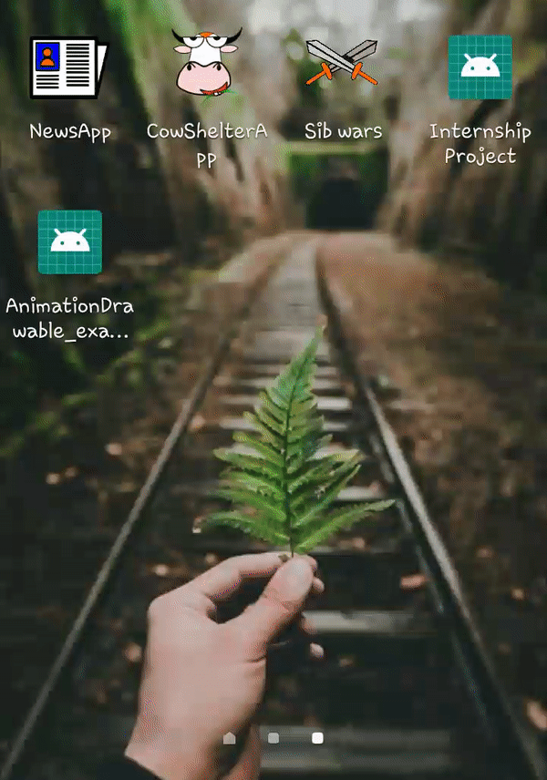

# Animation_examples_for_java
Simple project that showcases the animations you can integrate within some other project. 
I'll be using this repo to experiment with varieties of animation you can add in a java project since directly adding 
to a major project messes everything up.

### 1. Using Animation-Drawables
Created static vector frames using inkscape, and added to android studio project, setting the duration of each frame.
Can be used in splash-screens, although using them when data is being loaded crashes the app. Lottie animations don't 
work as splash screen animations, so here's the alternative way to go.

