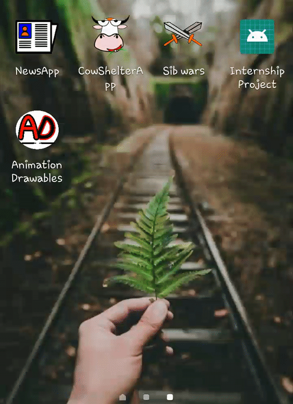

# Animation_examples_for_java
Simple project that showcases the animations you can integrate within some other project. 
I'll be using this repo to experiment with varieties of animation you can add in a java project since directly adding 
to a major project messes everything up.

### 1. Using timed Animation-Drawables as splash screens along with lottie.
Created static vector frames using inkscape, and added to android studio project, setting the duration of each frame to 150 milliseconds. Can be used in splash-screens, although using them instead of progress bars when loaders have been initialised crashes the app, because of less time span. Lottie animations can be used as timed splashscreens which isn't the recommended way to go, because splashscreens were originally thought as a method to beautify "cold-starts". Here, I have used timed animation-drawables, which progresses to show next activity after 2sec.

